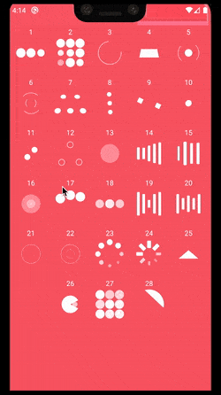
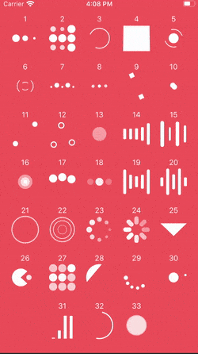

<h1 align="center">
  <div>
    React Native Loader Kit
  </div>
  <div>
  <a href="https://www.npmjs.com/package/react-native-loader-kit" target="_blank">
    
  </a>

  <a href="https://www.npmjs.com/package/react-native-loader-kit" target="_blank">
    
  </a>

  <a href="https://github.com/maitrungduc1410/react-native-loader-kit" target="_blank">
    
  </a>

  </div>
  <br>
  <div align="center">
    
    
  </div>
</h1>

Native loading indicators for React Native. Every indicator is a small JSON spec rendered by
[LoaderKit](https://github.com/maitrungduc1410/loader-kit), the same engine on iOS and Android,
so an indicator looks and moves the same on both platforms. You can tweak the built-in
indicators with params, write your own (experimental), and control playback (speed, pause, a
frozen frame, reduced motion). `LoaderKitProgress` shows the progress of a task in 9 types,
from linear and circular bars to gauges, liquid and batteries.

# Table of Contents
1. [Requirements](#requirements)
2. [Installation](#installation)
3. [Usage](#usage)
4. [Props](#props)
5. [Custom indicators](#custom-indicators)
6. [Indicators](#indicators)
7. [Progress indicators](#progress-indicators)
8. [Migrating from v4](#migrating-from-v4)
9. [Demo](#demo)

# Requirements

| Version | React Native | Architecture | Maintained on |
| --- | --- | --- | --- |
| 5.x | 0.76 or newer | New Architecture only | `master`, npm `latest` |
| 4.x | see the [v4 README](https://github.com/maitrungduc1410/react-native-loader-kit/tree/v4#readme) | New and old architecture | `v4` branch, npm `v4-lts` |

Version 5 needs the New Architecture (the default since React Native 0.76). An app built with
`newArchEnabled=false` (Android) or `RCT_NEW_ARCH_ENABLED=0` (iOS) fails at build time with a
message pointing to version 4, which you install with `npm install react-native-loader-kit@v4-lts`.

# Installation

```sh
npm install react-native-loader-kit
# or
yarn add react-native-loader-kit
```

iOS:

```sh
cd ios && pod install
```

Expo: run `npx expo prebuild`, then restart the project. Expo Go is not supported.

# Usage

```tsx
import { LoaderKitView } from 'react-native-loader-kit';

<LoaderKitView
  style={{ width: 50, height: 50 }}
  name="BallPulse"
  color="red"
/>
```

Params change an indicator without writing a new one. Each indicator documents its params in
its spec, for example `BallPulse` has `count` and `minScale`:

```tsx
<LoaderKitView name="BallPulse" params={{ count: 5, minScale: 0.5 }} color="#4fc1e9" />
```

# Props

| Prop | Type | Default | |
| --- | --- | --- | --- |
| `name` | built-in indicator name | `'BallPulse'` | |
| `spec` | `IndicatorSpec` | | a custom indicator, see below; use either `name` or `spec` |
| `params` | `Record<string, number>` | | overrides of the indicator params, unknown names are ignored |
| `color` | color | `'white'` | |
| `colors` | color[] | | one color per element, repeated when there are more elements; wins over `color` |
| `speed` | number | `1` | larger is faster; changing it never makes the animation jump |
| `animating` | boolean | `true` | `false` freezes the current frame |
| `hidesWhenStopped` | boolean | `false` | draw nothing while `animating` is `false` |
| `cycleProgress` | number in [0, 1] | | freeze the indicator at this point of its animation cycle instead of animating; it is not the progress of a task |
| `reduceMotion` | `'system' \| 'never' \| 'always'` | `'system'` | `system` shows a still frame when the system asks for reduced motion |

Plus every `View` prop. The indicator is drawn in a square that fills the smaller edge of the view.

# Custom indicators

> **Experimental.** Writing your own spec is experimental in 5.x: until the spec format is
> declared stable, a minor release may change it. The built-in indicators and their params are
> not affected.

An indicator is a set of elements placed in a unit box, with tracks that say how each property
changes over one cycle. `defineIndicator` checks the spec and throws an `InvalidIndicatorError`
listing every problem.

```tsx
import { LoaderKitView, defineIndicator, param } from 'react-native-loader-kit';

const Blink = defineIndicator({
  name: 'Blink',
  duration: 0.9, // seconds per cycle
  params: { count: 4, low: 0.15 },
  layout: { type: 'row', count: param('count'), gap: 0.08 },
  shape: { type: 'rect', cornerRadius: 0.25 },
  stagger: { each: 0.15 }, // element i starts 0.15 * i seconds later
  tracks: [
    { property: 'opacity', keyTimes: [0, 0.5, 1], values: [1, param('low'), 1], easing: 'easeInOut' },
    { property: 'scaleY', keyTimes: [0, 0.5, 1], values: [1, 0.5, 1], easing: 'easeInOut' },
  ],
});

<LoaderKitView spec={Blink} params={{ count: 6 }} color="white" style={{ width: 60, height: 60 }} />
```

Define specs outside of components (or memoize them): a new spec object restarts the animation.
The format is described in the [LoaderKit spec](https://github.com/maitrungduc1410/loader-kit/blob/master/SPEC.md).
The same spec runs in native Android, iOS, macOS and Windows apps through LoaderKit.

# Indicators

`BUILTIN_INDICATOR_NAMES` lists them at runtime. Every indicator is available on both platforms.

| # | Name | # | Name | # | Name |
| --- | --- | --- | --- | --- | --- |
| 1 | Atom | 18 | BallRotateChase | 35 | LineScalePulseOutRapid |
| 2 | AudioEqualizer | 19 | BallScale | 36 | LineSlide |
| 3 | BallBeat | 20 | BallScaleMultiple | 37 | LineSpinFadeLoader |
| 4 | BallClipRotate | 21 | BallScaleRipple | 38 | NewtonCradle |
| 5 | BallClipRotateMultiple | 22 | BallScaleRippleMultiple | 39 | Orbit |
| 6 | BallClipRotatePulse | 23 | BallSpinFadeLoader | 40 | Pacman |
| 7 | BallDoubleBounce | 24 | BallSquareSpin | 41 | Radar |
| 8 | BallFall | 25 | BallTrianglePath | 42 | RunningDots |
| 9 | BallGridBeat | 26 | BallZigZag | 43 | SemiCircleSpin |
| 10 | BallGridPulse | 27 | BallZigZagDeflect | 44 | SquareGridFlip |
| 11 | BallHelix | 28 | ChasingDots | 45 | SquareGridWave |
| 12 | BallHoneycomb | 29 | CircleStrokeSpin | 46 | SquareSpin |
| 13 | BallMerge | 30 | CubeTransition | 47 | Timer |
| 14 | BallPulse | 31 | JellyBox | 48 | TriangleOrbit |
| 15 | BallPulseRise | 32 | LineScale | 49 | TriangleSkewSpin |
| 16 | BallPulseSync | 33 | LineScaleParty | 50 | TripleArcSpin |
| 17 | BallRotate | 34 | LineScalePulseOut |  |  |

Every name of version 4 is still there. `BallRotateChase` and `CircleStrokeSpin`, which were
iOS-only, now work on Android too.

# Progress indicators

`LoaderKitProgress` shows how far a task has gone. Set `value` to a number in [0, 1], or leave it
`null` for the indeterminate animation. New values glide along a curve that follows the rhythm of
your updates and never passes the real value; `smooth={false}` jumps instead.

```tsx
import { LoaderKitProgress } from 'react-native-loader-kit';

<LoaderKitProgress value={progress} />
<LoaderKitProgress type="linear" variant="wavy" value={progress} />
<LoaderKitProgress type="gauge" value={progress} showLabel size={64} />
<LoaderKitProgress value={null} /> {/* indeterminate */}

<LoaderKitProgress value={progress} accessibilityLabel="Uploading video">
  <StopButton onPress={cancel} />
</LoaderKitProgress>
```

The [LoaderKit guide](https://maitrungduc1410.github.io/loader-kit/guide/progress) shows every
design live, with its code.

| `type` | `variant` | Box |
| --- | --- | --- |
| `linear` | `flat` (default), `wavy`, `segmented`, `striped`, `shimmer`, `glow`, `dots`, `steps` | the width it gets, by a height that fits the stroke |
| `circular` (default) | `flat` (default), `wavy`, `segmented`, `gradient`, `ticks`, `dots` | `size` by `size` |
| `pie` | `flat` | `size` by `size` |
| `gauge` | `flat` (default), `segmented` | `size` by `size` |
| `liquid` | `flat` | `size` by `size` |
| `border` | `flat` | its children plus the stroke |
| `bars` | `flat` | `size` by 0.75 `size` |
| `grid` | `flat` | `size` by `size` |
| `battery` | `flat` | `size` by 0.5 `size` |

| Prop | Type | Default | |
| --- | --- | --- | --- |
| `value` | number in [0, 1] or `null` | `null` | `null` shows the indeterminate animation |
| `smooth` | boolean | `true` | glide to new values |
| `type` | see above | `'circular'` | |
| `variant` | see above | the first of the type | |
| `buffer` | number in [0, 1] | | buffered part of linear `flat` and `wavy` |
| `size` | number | `48` | width of every type but linear and border |
| `color` | color | accent color | |
| `trackColor` | color | `color` at 24% opacity | |
| `labelColor` | color | text color | |
| `showLabel` | boolean | `false` | the percentage, inside or next to the indicator |
| `thickness` | number | depends on the type | |
| `trackGap` | number | `4` | space between the progress and the track, or between segments |
| `segments` | number | depends on the variant | segments, dots, ticks, steps, bars or grid columns |
| `stopIndicator` | boolean | `true` | dot at the end of the track of linear `flat` and `wavy` |
| `strokeCap` | `'round' \| 'butt'` | `'round'` | |
| `amplitude`, `wavelength`, `waveSpeed` | number | `3`, `40`, `1` for linear; `2`, `15`, `1` for circular | the wave of `wavy` |
| `sweepAngle` | number | `270` | arc of `gauge`, in degrees |
| `cornerRadius` | number | `12` | corners of `border` |
| `speed` | number | `1` | playback rate of the indeterminate animation; 0 or less pauses it |
| `reduceMotion` | `'system' \| 'never'` | `'system'` | `system` jumps to new values, stops the waves, stripes and sheens and slows the indeterminate animation while the system asks for reduced motion |

`LoaderKitProgress` is a `View` holding the drawing, which fills it, and the children, drawn above
it, so every `View` prop applies (`pointerEvents`, `borderRadius`, `onLayout`, and so on). The
style you pass wins over the box above, and the drawing fits whatever box it gets: for the
square types, `style={{ width: 120, height: 120 }}` gives the same box as `size={120}`. The types with a `size` center their
children, which suits a stop button over circular, pie and gauge; `border` frames them.

Screen readers announce a progress bar and its percentage. `accessibilityLabel` names it
(default "Loading" on iOS); the children stay reachable on their own.

# Migrating from v4

- The New Architecture is required (see [Requirements](#requirements)).
- `animationSpeedMultiplier` is now `speed`.
- `IndicatorName` is now `BuiltinIndicatorName`, and `ALL_INDICATORS` is `BUILTIN_INDICATOR_NAMES`.
  `CommonIndicatorName`, `IOSOnlyIndicatorName`, `COMMON_INDICATORS`, `IOS_ONLY_INDICATORS`,
  `isIndicatorAvailableOnPlatform` and `getAvailableIndicators` are gone: every indicator works
  on both platforms.
- The indicator names are unchanged.
- On Android the indicators no longer come from AVLoadingIndicatorView, so their timing now
  matches iOS (easing curves, keyframe times, start delays, density-independent sizes).

# Troubleshooting

## uses-sdk:minSdkVersion XX cannot be smaller than version YY

You can override the SDK versions in your `android/build.gradle` > `buildscript` > `ext`:

```gradle
buildscript {
    ext {
        LoaderKit_kotlinVersion=2.0.21
        LoaderKit_minSdkVersion=24
        LoaderKit_targetSdkVersion=34
        LoaderKit_compileSdkVersion=35
    }
}
```

# Demo

A fully working demo is located in the [example folder](./example/src/App.tsx).

# Thanks

The indicators of version 4 reproduce the work of
[NVActivityIndicatorView](https://github.com/ninjaprox/NVActivityIndicatorView) and
[loaders.css](https://github.com/ConnorAtherton/loaders.css); `ChasingDots` and `SquareGridWave`
reproduce [SpinKit](https://github.com/tobiasahlin/SpinKit). Version 4 used
[AVLoadingIndicatorView](https://github.com/81813780/AVLoadingIndicatorView) on Android.
