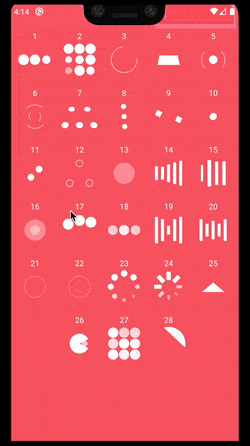
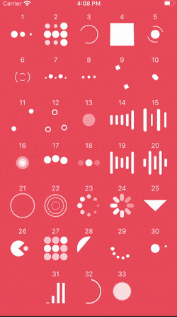

<h1 align="center">
  <div>
    React Native Loader Kit
  </div>
  <div>
  

  

  

  
  </div>
  <br>
  <div align="center">
    
    
  </div>
</h1>

# Table of Contents
1. [Installation](#Installation)
2. [Usage](#usage)
3. [List animations](#list-animations)
4. [Demo](#demo)

# Installation
With npm:
`$ npm install react-native-loader-kit --save`

With yarn:
`$ yarn add react-native-loader-kit`

## Extra setup step for iOS
Run the following command to setup for iOS:
```
cd ios && pod install
```
# Usage
```js
import LoaderKit from 'react-native-loader-kit'

<LoaderKit
  style={{ width: 50, height: 50 }}
  name={'BallPulse'} // Optional: see list of animations below
  size={50} // Required on iOS
  color={'red'} // Optional: color can be: 'red', 'green',... or '#ddd', '#ffffff',...
/>
```
> Note: size is required for iOS
# List animations
As shown in the demo above, animations are as follows: 
## Default animations (both Android and iOS)
```json
  '1': 'BallPulse',
  '2': 'BallGridPulse',
  '3': 'BallClipRotate',
  '4': 'SquareSpin',
  '5': 'BallClipRotatePulse',
  '6': 'BallClipRotateMultiple',
  '7': 'BallPulseRise',
  '8': 'BallRotate',
  '9': 'CubeTransition',
  '10': 'BallZigZag',
  '11': 'BallZigZagDeflect',
  '12': 'BallTrianglePath',
  '13': 'BallScale',
  '14': 'LineScale',
  '15': 'LineScaleParty',
  '16': 'BallScaleMultiple',
  '17': 'BallPulseSync',
  '18': 'BallBeat',
  '19': 'LineScalePulseOut',
  '20': 'LineScalePulseOutRapid',
  '21': 'BallScaleRipple',
  '22': 'BallScaleRippleMultiple',
  '23': 'BallSpinFadeLoader',
  '24': 'LineSpinFadeLoader',
  '25': 'TriangleSkewSpin',
  '26': 'Pacman',
  '27': 'BallGridBeat',
  '28': 'SemiCircleSpin'
```
## iOS extra animations
```json
  '1': 'BallRotateChase',
  '2': 'Orbit',
  '3': 'AudioEqualizer',
  '4': 'CircleStrokeSpin',
  '5': 'BallDoubleBounce'
```
# Demo
A fully working demo is located at [example folder](./example/App.js)

# Thanks
Big thanks to [81813780](https://github.com/81813780/AVLoadingIndicatorView) and [ninjaprox](https://github.com/ninjaprox/NVActivityIndicatorView) for their wonderful works

If you like this project, encourage me by giving me a ⭐️. Happy hacking